---

# 👨‍💻 Sobre mim

Olá! Meu nome é **Cauê Teles**.

Sou estudante de **Análise e Desenvolvimento de Sistemas (ADS)** pelo **Senac**, apaixonado por tecnologia e desenvolvimento de software.

Tenho conhecimentos em:

- 🐍 Python
- ☕ Java
- 🌐 HTML5
- 🎨 CSS
- 🗄️ Banco de Dados
- 🐬 MySQL
- 🖥️ Hardware
- 🪟 Windows
- 🐧 Linux
- 🍎 macOS

Estou constantemente estudando e desenvolvendo projetos para aprimorar minhas habilidades em programação e tecnologia.

---

# 🚀 Tecnologias

---

# 📂 Projetos

---

# 📊 GitHub Stats

---

# 🔥 GitHub Streak

---

# 📈 GitHub Activity

---

# 🏆 GitHub Trophies

---

# 🐍 Contribution Snake

---

# 🌐 Contato

---

